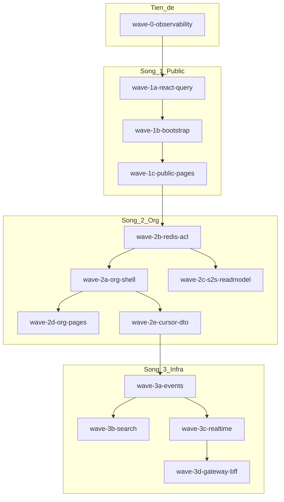

# Chỉ mục — Performance & load data (3 sóng)

> **Vị trí:** `VoiceHub/.cursor/plans/` (repo workspace).  
> Plan Cursor UI trước đó có thể nằm ở `%USERPROFILE%/.cursor/plans/` — dùng bản trong repo này khi build.

## Mục tiêu chung

Giảm round-trip HTTP, latency S2S, refetch FE, và payload Mongo — theo thứ tự **đo → shell public → shell org → hạ tầng dài hạn**, tuân [voicehub-constraints.mdc](../rules/voicehub-constraints.mdc).

## Sơ đồ phụ thuộc

## Danh sách plan (build lần lượt)

| # | File | Sóng | Phụ thuộc |
|---|------|------|-----------|
| 0 | [wave-0-observability.plan.md](./wave-0-observability.plan.md) | Tiền đề | — |
| 1 | [wave-1a-react-query-client.plan.md](./wave-1a-react-query-client.plan.md) | 1 | 0 |
| 2 | [wave-1b-bootstrap-gateway.plan.md](./wave-1b-bootstrap-gateway.plan.md) | 1 | 1a |
| 3 | [wave-1c-public-pages-optimize.plan.md](./wave-1c-public-pages-optimize.plan.md) | 1 | 1b |
| 4 | [wave-2b-redis-acl-cache.plan.md](./wave-2b-redis-acl-cache.plan.md) | 2 | 1c |
| 5 | [wave-2a-org-shell.plan.md](./wave-2a-org-shell.plan.md) | 2 | 2b |
| 6 | [wave-2d-org-pages-overview.plan.md](./wave-2d-org-pages-overview.plan.md) | 2 | 2a |
| 7 | [wave-2e-cursor-pagination-dto.plan.md](./wave-2e-cursor-pagination-dto.plan.md) | 2 | 2a |
| 8 | [wave-2c-s2s-readmodel-acl.plan.md](./wave-2c-s2s-readmodel-acl.plan.md) | 2 | 2b, 2e |
| 9 | [wave-3a-event-read-models.plan.md](./wave-3a-event-read-models.plan.md) | 3 | 2c |
| 10 | [wave-3b-search-engine.plan.md](./wave-3b-search-engine.plan.md) | 3 | 2e |
| 11 | [wave-3c-realtime-snapshots.plan.md](./wave-3c-realtime-snapshots.plan.md) | 3 | 1a, 2a |
| 12 | [wave-3d-gateway-bff-layer.plan.md](./wave-3d-gateway-bff-layer.plan.md) | 3 | 1b, 2a, 2d |

## Map 10 vấn đề → plan

| # | Vấn đề | Plan |
|---|--------|------|
| 1 | Nhiều HTTP/màn | 1b, 1c, 2a, 2d, 3d |
| 2 | S2S runtime | 2b, 2c, 3a |
| 3 | Cache Redis | 2b |
| 4 | Sidebar boot | 1a, 1b |
| 5 | FE cache | 1a |
| 6 | Pagination | 2e, 2d |
| 7 | Mongo DTO/index | 0, 2e |
| 8 | Search engine | 3b |
| 9 | Realtime snapshot | 3c |
| 10 | Gateway BFF | 1b, 3d |

## Hiện trạng (điểm neo code)

- Gateway proxy: `api-gateway/src/middlewares/proxy.middleware.js`
- Boot client: `client/src/context/AuthContext.jsx`, `client/src/components/Layout/NavigationSidebar.jsx`
- Org load: `client/src/pages/Workspace/OrganizationsPage.jsx`
- Chat→Org: `services/chat-service/src/controllers/message.controller.js` (`fetchAccessibleChannelIds`)
- Org documents: `client/src/features/orgDocuments/useOrganizationDocuments.js` (8×50 search)
- Chưa React Query: `client/package.json`

## Quy tắc build

- Route mới chỉ khi không gộp được query trên route sẵn; ghi lý do PR.
- Không đổi JWT/auth trừ task riêng.
- Mỗi PR ≈ 1 plan con hoặc 1 phase trong plan con.
- **LAN (wave-1b → 3d):** dev chuẩn **`https://voicehub.local/`** — [_lan-dev-preamble-snippet.md](./_lan-dev-preamble-snippet.md) + [docs/lan-https-voicehub.local.md](../../docs/lan-https-voicehub.local.md) + [voicehub-constraints.mdc](../rules/voicehub-constraints.mdc). `VITE_API_URL=/api`, socket/HMR qua Nginx TLS. Không hardcode IP/localhost trong URL runtime. Verify script + máy LAN (`hosts`).

## Plan có mục LAN riêng

Từ [wave-1b](./wave-1b-bootstrap-gateway.plan.md) đến [wave-3d](./wave-3d-gateway-bff-layer.plan.md) — section **Tiền đề — Dev `https://voicehub.local`** (checklist chung + mục riêng từng sóng).
