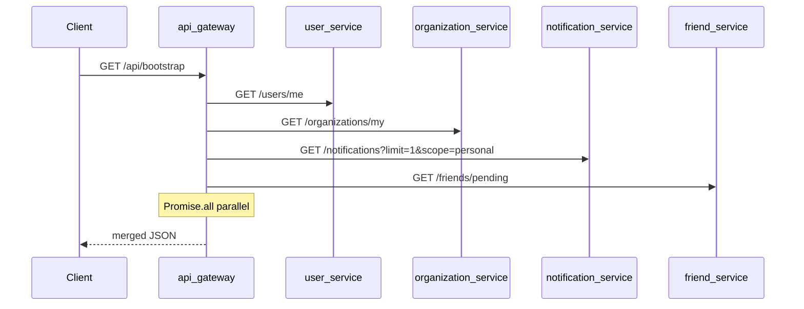

# Wave 1B — Bootstrap endpoint (Gateway BFF mỏng)

**Sóng:** 1 — Public  
**Phụ thuộc:** [wave-1a-react-query-client.plan.md](./wave-1a-react-query-client.plan.md)  
**Tiếp theo:** [wave-1c-public-pages-optimize.plan.md](./wave-1c-public-pages-optimize.plan.md)  
**Giải quyết:** #1, #4, #10 (bước đầu)

## Tiền đề — Dev `https://voicehub.local`

> **Bắt buộc mọi plan từ 1b → 3d.** Checklist đầy đủ: [_lan-dev-preamble-snippet.md](./_lan-dev-preamble-snippet.md) · [docs/lan-https-voicehub.local.md](../../docs/lan-https-voicehub.local.md) · [voicehub-constraints.mdc](../rules/voicehub-constraints.mdc)

### Riêng wave 1B (bootstrap BFF)

- Client: **`GET /api/bootstrap`** (relative qua `VITE_API_URL=/api`), không `http://localhost:3000/api/bootstrap` hay IP LAN.
- `bootstrapService.js` / `AuthContext`: chỉ dùng `api` + `resolveApiBaseUrl()` — không `axios` riêng baseURL tuyệt đối.
- Gateway handler: downstream `http://*-service:port` (Docker). **Không** dùng IP/`Host` browser cho URL nội bộ.
- `user.avatar` trong response: `/uploads/...` — FE `resolveMediaUrl()`; gateway `/uploads` proxy có `pathRewrite` (tránh 404 avatar).
- **Verify:** `verify-lan-https.ps1 -BaseUrl https://voicehub.local`; login trên máy LAN (hosts) — Network chỉ `voicehub.local`.

## Lý do route mới (theo rule repo)

Không gộp được một service: dữ liệu nằm 4 service (user, org, notification, friend). **Một** `GET /api/bootstrap` thay **4** round-trip client → gateway (mỗi cái 1× JWT).

## Kiến trúc



## File chính

- `api-gateway/src/routes/bootstrap.routes.js` (mới) — mount **trước** proxy hoặc trong `routes/index.js` sau auth
- `api-gateway/src/services/bootstrap.service.js` (mới) — HTTP client nội bộ + `GATEWAY_INTERNAL_TOKEN`
- `api-gateway/src/config/permissions.js` — `'GET /api/bootstrap': ...` hoặc `noPermissionRoutes`
- `api-gateway/src/config/services.js` — không cần nếu handler local
- `client/src/services/bootstrapService.js` (mới)
- `client/src/context/AuthContext.jsx` — sau login gọi bootstrap

## Response contract (v1)

```json
{
  "user": { "id", "email", "displayName", "avatar" },
  "organizations": [{ "id", "name", "slug", "icon" }],
  "badges": {
    "notificationsUnreadPersonal": 0,
    "friendPending": 0
  }
}
```

Org badge **không** gộp bootstrap v1 (phụ thuộc active org) — giữ query riêng hoặc thêm query `?organizationId=` ở v2.

## Downstream gọi (server-side)

| Nguồn | Endpoint nội bộ | Header |
|-------|-----------------|--------|
| user-service | `GET /api/users/me` | `x-user-id`, internal token |
| organization-service | `GET /api/organizations/my` | same |
| notification-service | `GET /api/notifications?scope=personal&limit=1` | same |
| friend-service | `GET /api/friends/pending` | same |

Timeout tổng 5–8s; partial failure → trả field null + log (không fail cả bootstrap trừ user).

## Client

1. Sau `auth/me` thành công → `GET /bootstrap`.
2. `queryClient.setQueryData` cho organizations, badges.
3. Sidebar bỏ fetch trùng organizations/my nếu cache đã có.

## Tiêu chí hoàn thành

- [ ] Cold login: ≤2 request shell (auth/me + bootstrap) thay ≥5
- [ ] Permission/JWT không đổi flow hiện tại
- [ ] Document trong PR / comment gateway README

## PR gợi ý

PR1: gateway handler + contract. PR2: client + hydrate query cache.
