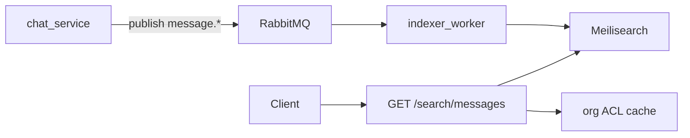

# Wave 3B — Search engine

**Sóng:** 3  
**Phụ thuộc:** [wave-2e-cursor-pagination-dto.plan.md](./wave-2e-cursor-pagination-dto.plan.md), [wave-3a](./wave-3a-event-read-models.plan.md) (index pipeline)  
**Giải quyết:** #8

## Tiền đề — Dev `https://voicehub.local`

> Checklist chung: [_lan-dev-preamble-snippet.md](./_lan-dev-preamble-snippet.md) · [docs/lan-https-voicehub.local.md](../../docs/lan-https-voicehub.local.md)

### Riêng wave 3B (search)

- Browser chỉ gọi gateway `GET /api/.../search` — **không** expose URL Elasticsearch/OpenSearch ra `client/.env`.
- Org workspace search UI: test từ `https://voicehub.local/w/...` trên máy LAN.

## Mục tiêu

`GET /messages/search` không dùng Mongo regex/text khi volume lớn.

## Phạm vi v1

- Org channel message search (text + hasAttachment filter)
- File name search trong org documents overview
- **Không** thay DM search ngay (phase 2)

## Kiến trúc

ACL: filter `roomId in allowedChannelIds` **sau** search (hoặc filter trong index theo orgId+roomId).

## Index fields

`messageId, organizationId, roomId, content, senderDisplayName, hasAttachment, attachments.name, createdAt`

## Client

- `client/src/features/search/orgChatSearchConfig.js` → endpoint mới
- `useOrganizationDocuments` dùng search + overview (2d)

## Tiêu chí hoàn thành

- [ ] Search 10k+ messages org <500ms p95 trên staging
- [ ] Kết quả respect ACL (user không thấy room cấm)

## PR gợi ý

PR1 docker meilisearch + indexer. PR2 API + FE. PR3 backfill script.
