# VoiceHub - 11 luồng hoạt động chính (chi tiết + rút gọn)

Tài liệu này tổng hợp 11 luồng cốt lõi của hệ thống VoiceHub.
Mỗi luồng gồm:
- **Sơ đồ chi tiết** (sequenceDiagram)
- **Sơ đồ rút gọn** (flowchart)

---

## Luồng 1 - Xác thực người dùng (Auth)

### 1.1 Chi tiết
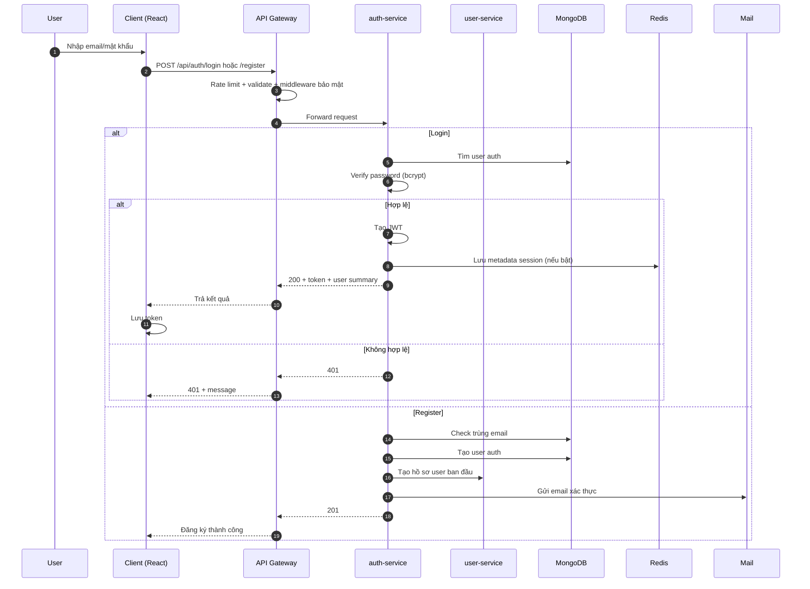

### 1.2 Rút gọn
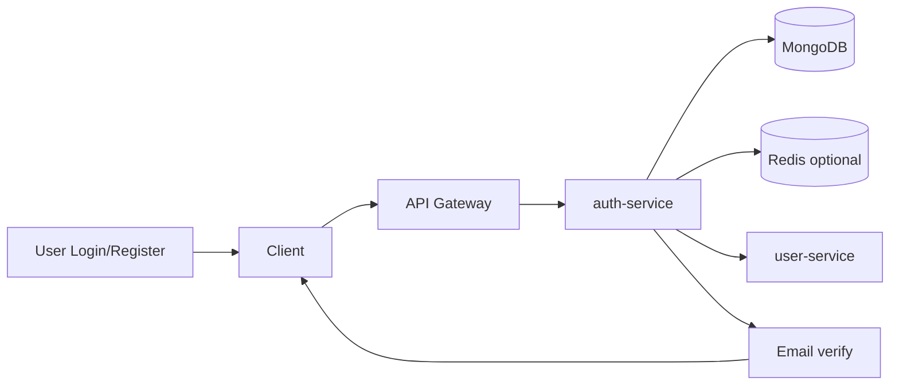

---

## Luồng 2 - Bootstrap dữ liệu sau đăng nhập

### 2.1 Chi tiết
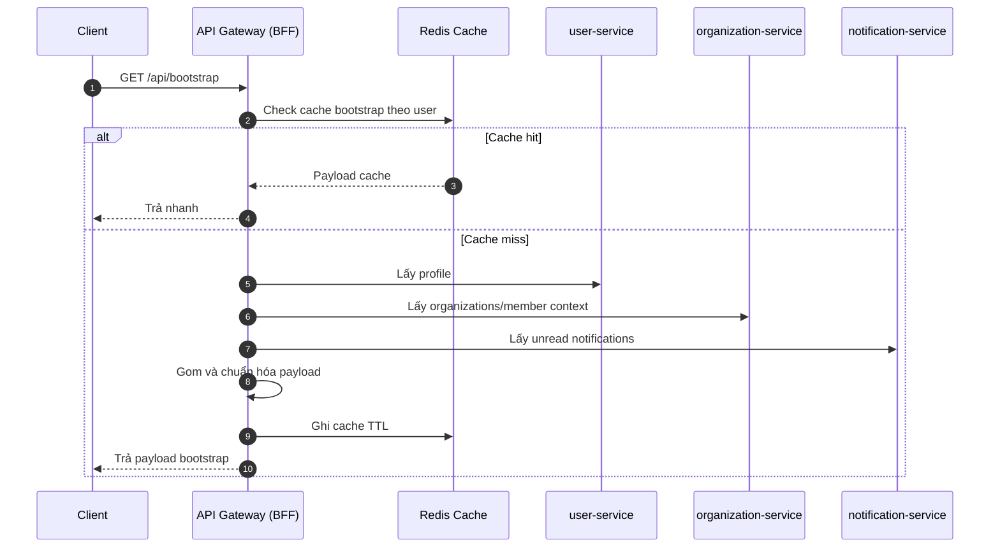

### 2.2 Rút gọn
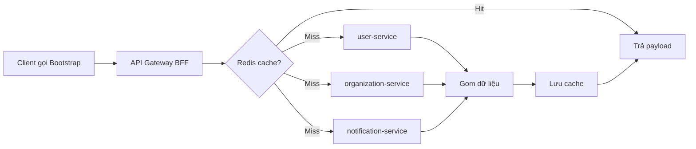

---

## Luồng 3 - RBAC và kiểm soát truy cập theo tổ chức

### 3.1 Chi tiết
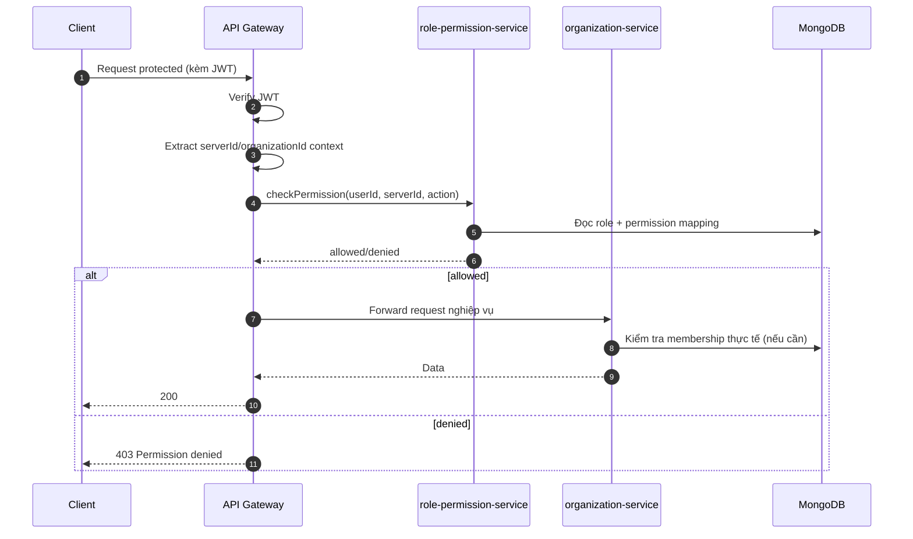

### 3.2 Rút gọn
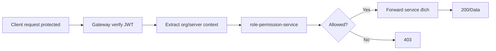

---

## Luồng 4 - Quản trị cấu trúc tổ chức (branch/division/department/team/channel)

### 4.1 Chi tiết
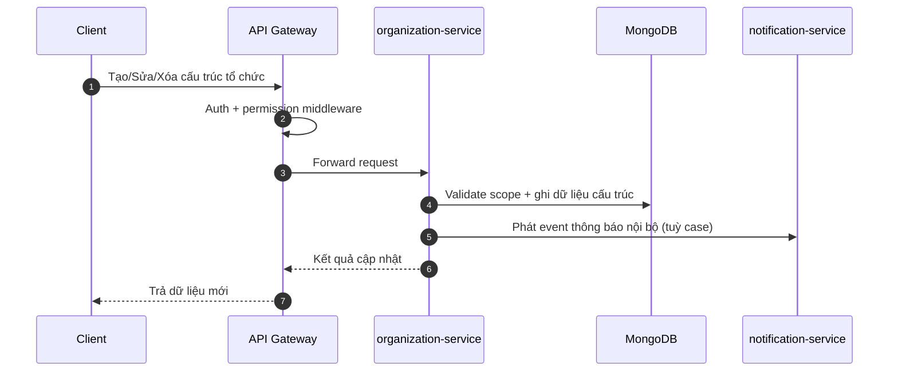

### 4.2 Rút gọn
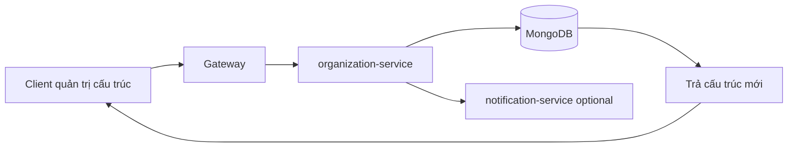

---

## Luồng 5 - Chat realtime (DM + Organization chat)

### 5.1 Chi tiết
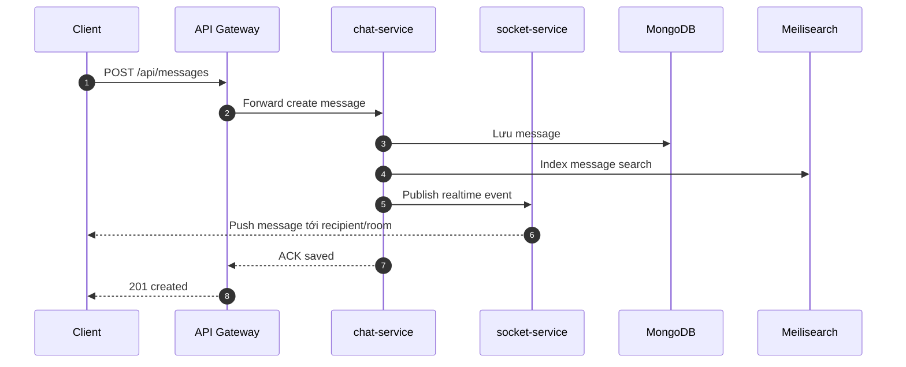

### 5.2 Rút gọn
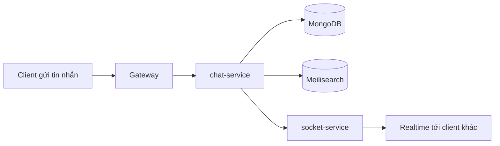

---

## Luồng 6 - Voice/Meeting realtime (WebRTC + SFU)

### 6.1 Chi tiết
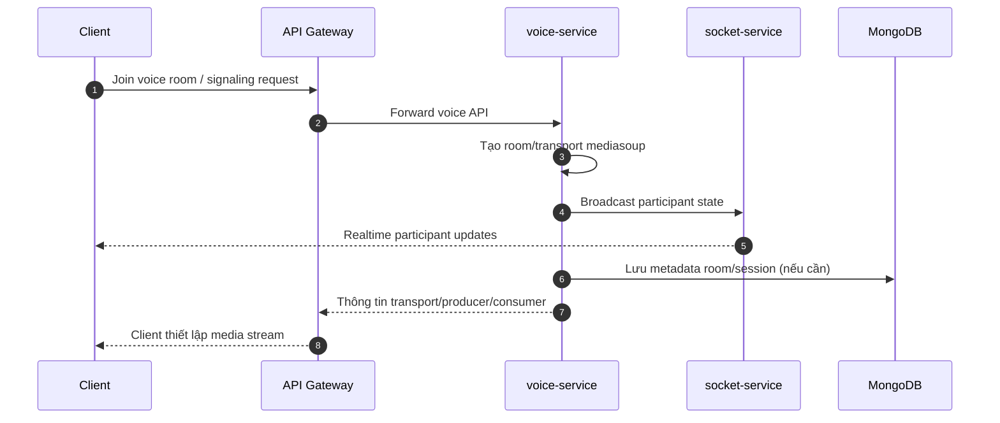

### 6.2 Rút gọn
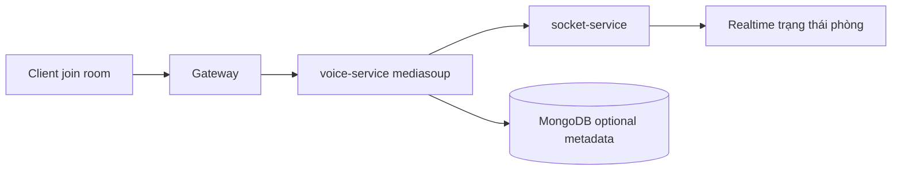

---

## Luồng 7 - Quản lý công việc (Task)

### 7.1 Chi tiết
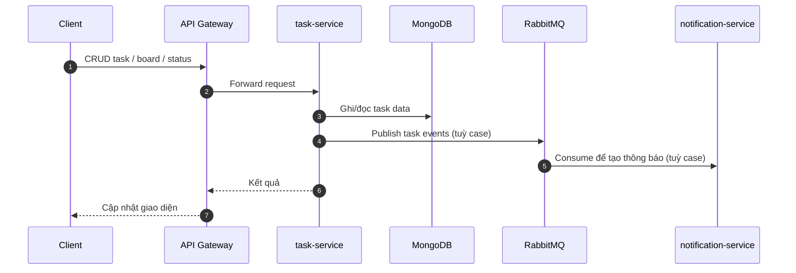

### 7.2 Rút gọn
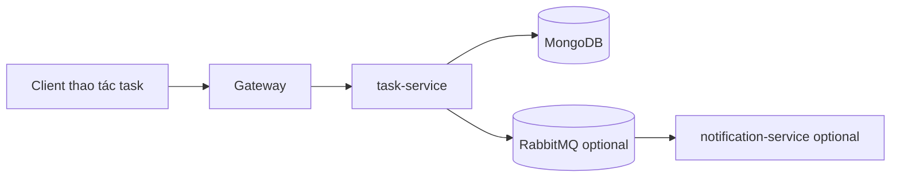

---

## Luồng 8 - AI Task/OCR xử lý nền

### 8.1 Chi tiết
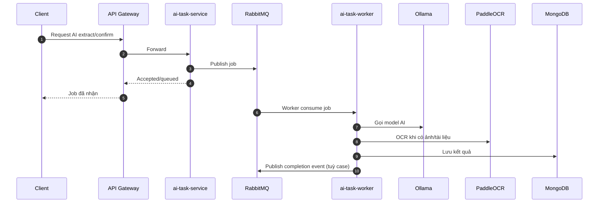

### 8.2 Rút gọn
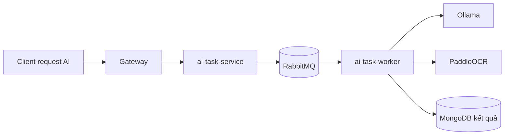

---

## Luồng 9 - Tài liệu và file (upload/download)

### 9.1 Chi tiết
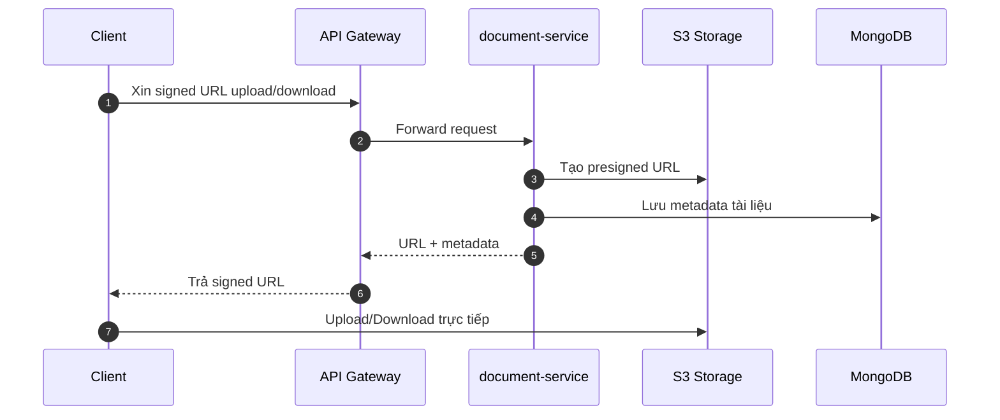

### 9.2 Rút gọn
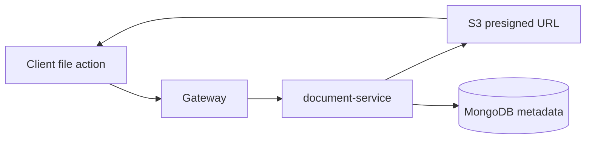

---

## Luồng 10 - Thông báo tập trung

### 10.1 Chi tiết
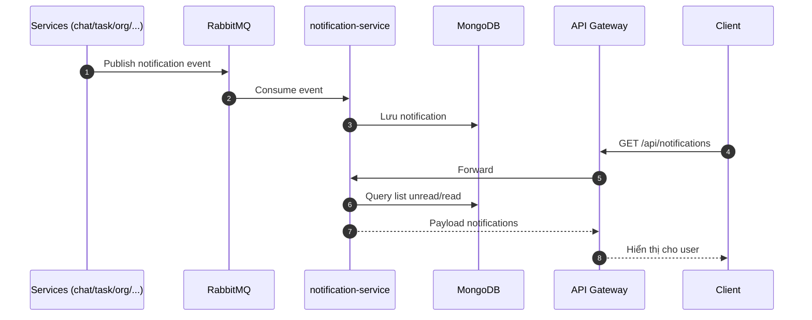

### 10.2 Rút gọn
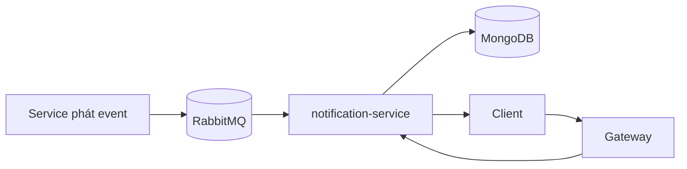

---

## Luồng 11 - Bảo mật và điều phối request tại Gateway (cross-cutting)

### 11.1 Chi tiết
```mermaid
sequenceDiagram
    autonumber
    participant FE as Client
    participant GW as API Gateway
    participant RP as role-permission-service
    participant SV as Target Service

    FE->>GW: Request /api/*
    GW->>GW: CORS + Helmet + Rate Limit
    GW->>GW: Auth middleware (JWT)
    alt Route cần permission
        GW->>GW: Extract action + org/server context
        GW->>RP: Check permission
        RP-->>GW: allowed/denied
    end

    alt Allowed
        GW->>SV: Proxy request
        SV-->>GW: Response
        GW-->>FE: 2xx/4xx từ service
    else Denied hoặc thiếu context
        GW-->>FE: 401/403/400
    end
```

### 11.2 Rút gọn
```mermaid
flowchart LR
A[Client request] --> B[Gateway security layers]
B --> C[JWT Auth]
C --> D{Need permission?}
D -- Yes --> E[Check role-permission]
D -- No --> G[Proxy service]
E --> F{Allowed?}
F -- Yes --> G
F -- No --> H[Reject 403/400]
G --> I[Response]
```

---

## Gợi ý dùng tài liệu cho thuyết trình 15 phút

- Dùng bản **rút gọn** cho slide chính.
- Chỉ mở bản **chi tiết** khi bị hỏi sâu ở Q&A.
- Nên ưu tiên trình bày các luồng: **1, 3, 5, 6, 8, 11** (nổi bật nhất về kiến trúc và giá trị hệ thống).

