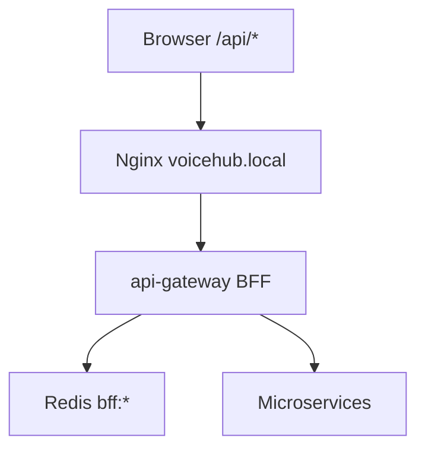

# Gateway BFF layer (wave 3D)

## Vai trò

API Gateway (`api-gateway`) không chỉ reverse-proxy: các **read aggregate** được gom tại `src/bff/`, cache Redis ngắn, và **request coalescing** khi nhiều tab F5 cùng lúc.



## Module (`api-gateway/src/bff/`)

| File | Mô tả |
|------|--------|
| `httpDownstream.js` | `buildTrustedHeaders`, `fetchJson`, `unwrapPayload` |
| `cache.js` | Redis `bff:bootstrap:{userId}`, `bff:shell:{userId}:{orgId}`, … |
| `coalesce.js` | In-flight dedupe cùng key |
| `bffRead.js` | `bffCachedRead` = cache → coalesce → loader |
| `bootstrap.handler.js` | `GET /api/bootstrap` |
| `orgShell.handler.js` | `GET /api/organizations/:orgId/shell` |
| `documentsOverview.handler.js` | Cache read-through tới org-service |
| `dashboardSummary.handler.js` | `GET /api/dashboard/summary` |

## Cache TTL (mặc định)

| Route | Key | TTL |
|-------|-----|-----|
| `/api/bootstrap` | `bff:bootstrap:{userId}` | 45s |
| `/api/organizations/:id/shell` | `bff:shell:{userId}:{orgId}` | 60s |
| `/api/organizations/:id/documents-overview` | `bff:documents-overview:{userId}:{orgId}` | 45s |
| `/api/dashboard/summary` | `bff:dashboard-summary:{userId}` | 45s |

Invalidate chính xác tuyệt đối không bắt buộc — TTL ngắn + socket `org:shell:updated` (wave 3C) khiến client refetch shell.

Response header `X-Bff-Cache: HIT` khi trả từ Redis.

## Nguyên tắc

- **Read aggregation** tại gateway khi cross-service (bootstrap, dashboard).
- **Single-service aggregate** (documents-overview logic) vẫn ở organization-service; gateway chỉ cache response.
- **Write** vẫn proxy thẳng microservice.
- **JWT + permission** không đổi; org BFF routes chạy sau `permissionMiddleware`.

## Env (`api-gateway/.env`)

```
REDIS_HOST=redis
REDIS_PORT=6379
BFF_CACHE_ENABLED=true
BFF_BOOTSTRAP_CACHE_TTL_SEC=45
BFF_SHELL_CACHE_TTL_SEC=60
GATEWAY_INTERNAL_TOKEN=...
```

## Verify

1. Hai tab cùng user F5 `GET /api/bootstrap` — lần 2 có `X-Bff-Cache: HIT`; log org-service không nhân đôi trong cửa sổ coalesce (~vài trăm ms).
2. Vào workspace — `GET /api/organizations/:id/shell` qua gateway, không gọi thẳng org-service:3013 từ browser.
